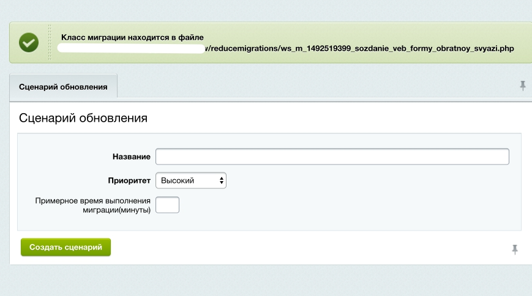
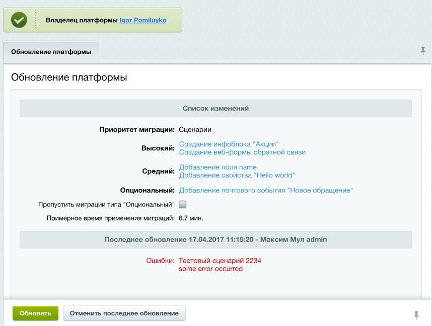

##### [Главная страница](../README.md)

### Работа со скриптами миграций

`Модуль миграций` предоставляет
функционал создания "гибкой миграции" путем определения сценария миграции программистом. Также имеется набор классов для быстрого и удобного
создания новых данных.

#### 1. Создание класса сценария миграции

Создание класса сценария осуществляется из меню `Миграции данных -> Сценарий обновления`,
где необходимо ввести название сценария, выбрать тип миграции и примерное время выполнения

Миграций выполняются в порядке приоритета:
Высокий, Средний, Опциональный. В пределах типа сортировка миграций осуществляется по дате создания файла.
Миграции типа "Опциональный" могут быть скипнуты.

###### Создание сценария. Ввод названия


Название можно задавать кириллицей. После создания появляется сообщение с информацией о местонахождении файла класса



#### 2. Редактирование. Определение алгоритма исполнения скрипта

По пути, указанному в сообщении находится следующий класс

###### Сценарий. Редактирование класса

```php
<?php

/**
 * Class definition update migrations scenario actions
 **/
class ws_m_1492519399_sozdanie_veb_formy_obratnoy_svyazi extends \WS\ReduceMigrations\Scenario\ScriptScenario {

    /**
     * Name of scenario
     **/
    static public function name() {
        return "Создание веб-формы обратной связи";
    }

    /**
     * Priority of scenario
     **/
    static public function priority() {
        return "high";
    }

    /**
     * @return string hash
     */
    static public function hash() {
        return "55925bade27806617493ee99588050aca0463073";
    }

    /**
     * @return string is owner name
     */
    static public function owner() {
        return "Igor Pomiluyko";
    }

    /**
     * @return string approximately time
     */
    static public function approximatelyTime() {
        return "2";
    }

    /**
     * Write action by apply scenario. Use method `setData` for save need rollback data
     **/
    public function commit() {
        // my code
    }

    /**
     * Write action by rollback scenario. Use method `getData` for getting commit saved data
     **/
    public function rollback() {
        // my code
    }
}
```


В нем предназначены для модификации два метода:
* `commit` - содержит алгоритм применения миграции
* `rollback` - содержит алгоритм отката миграции

Методы `getData` и `setData` предоставляют доступ к данным и их сохранение соответственно, необходимо для сохранения данных для отката.

#### 3. Применение

Применение сценариев миграций осуществляется через функционал общего применения.

###### Применение сценариев миграций



Данные по сценариям миграций также попадают в журнал изменений.

#### Классы для упрощения работы с предметной областью

Для сценариев миграций существуют классы (билдеры) позволяющие гибко и быстро создавать новые сущности данных.

Работа с билдерами строится следующим образом:

```php
<?php

$ibBuilder = new \WS\ReduceMigrations\Builder\IblockBuilder();
$ibBuilder->createIblock('type_content', 'Новости', function (\WS\ReduceMigrations\Builder\Entity\Iblock $iblock) {
    $iblock
        ->siteId('s1')
        ->sort(100)
        ->code('news')
        ->groupId(array(
           '2' => 'R' 
        ));
    $iblock
        ->addProperty('Выводить на главной')
        ->code('showOnMain')
        ->typeCheckbox()
        ->addEnum('да');
});

```

Перечень классов:

* \WS\ReduceMigrations\Builder\TableBuilder
* \WS\ReduceMigrations\Builder\IblockBuilder
* \WS\ReduceMigrations\Builder\HighLoadBlockBuilder
* \WS\ReduceMigrations\Builder\FormBuilder
* \WS\ReduceMigrations\Builder\EventsBuilder
* \WS\ReduceMigrations\Builder\AgentBuilder
